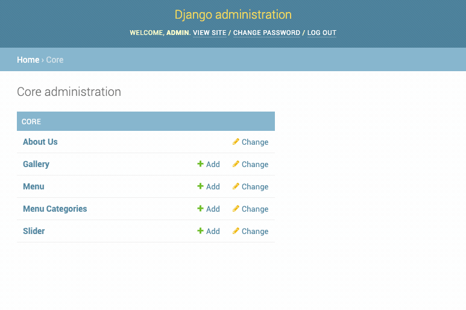

# Single Instance Model

## Why?

We use Django for a lot of different things including CMS-style projects. In a CMS-style project, **the user often needs to be able to just modify some data that shows up on the site**. Maybe it's the content of a page.



The concept is simple: __There's always going to be exactly one instance of this model.__


## Installation

To install, `pip install django-single-instance-model`.


## Usage

In `models.py`:

```python
from django.db import models
from single_instance_model.models import SingleInstanceModel


class AboutUs(models.Model, SingleInstanceModel):
    text = models.TextField(max_length=2000)
```

In `admin.py`:

```python
from django.contrib import admin
from single_instance_model.admin import SingleInstanceModelAdmin
from . import models


@admin.register(models.AboutUs)
class AboutUsAdmin(SingleInstanceModelAdmin):
    pass
```


## Warning

This works by executing code **every time a database connection is established**.  It's a simple check to create the instance of the model if it doesn't exist.. but just be aware.